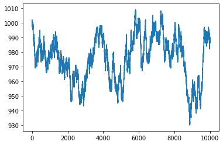
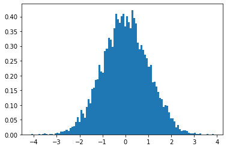
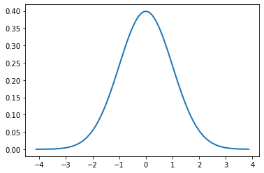
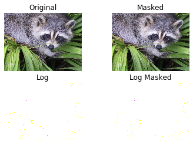
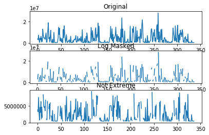

```python
#basic descriptive statistics 기술통계량
```


```python
#matplotlib 차트나 plot으로 그려주는 라이브러리 inline: 바로 보여줌
%matplotlib inline
```


```python
import numpy as np
from scipy.stats import scoreatpercentile
#from scipy.stats : 표준 연속/이산 확률 분포와 다양한 통계함수
#백분위수
import pandas as pd
```


```python
data=pd.read_csv("co2.csv",index_col=0,parse_dates=True)
#인덱스 설정 / 날짜형식은 날짜로 인식
co2=np.array(data.co2)
```


```python
data
```


<div>
<style scoped>
    .dataframe tbody tr th:only-of-type {
        vertical-align: middle;
    }

    .dataframe tbody tr th {
        vertical-align: top;
    }

    .dataframe thead th {
        text-align: right;
    }
</style>
<table border="1" class="dataframe">
  <thead>
    <tr style="text-align: right;">
      <th></th>
      <th>co2</th>
    </tr>
    <tr>
      <th>date</th>
      <th></th>
    </tr>
  </thead>
  <tbody>
    <tr>
      <th>1959-01-01</th>
      <td>315.42</td>
    </tr>
    <tr>
      <th>1959-02-01</th>
      <td>316.31</td>
    </tr>
    <tr>
      <th>1959-03-01</th>
      <td>316.50</td>
    </tr>
    <tr>
      <th>1959-04-01</th>
      <td>317.56</td>
    </tr>
    <tr>
      <th>1959-05-01</th>
      <td>318.13</td>
    </tr>
    <tr>
      <th>1959-06-01</th>
      <td>318.00</td>
    </tr>
    <tr>
      <th>1959-07-01</th>
      <td>316.39</td>
    </tr>
    <tr>
      <th>1959-08-01</th>
      <td>314.65</td>
    </tr>
    <tr>
      <th>1959-09-01</th>
      <td>313.68</td>
    </tr>
    <tr>
      <th>1959-10-01</th>
      <td>313.18</td>
    </tr>
    <tr>
      <th>1959-11-01</th>
      <td>314.66</td>
    </tr>
    <tr>
      <th>1959-12-01</th>
      <td>315.43</td>
    </tr>
    <tr>
      <th>1960-01-01</th>
      <td>316.27</td>
    </tr>
    <tr>
      <th>1960-02-01</th>
      <td>316.81</td>
    </tr>
    <tr>
      <th>1960-03-01</th>
      <td>317.42</td>
    </tr>
    <tr>
      <th>1960-04-01</th>
      <td>318.87</td>
    </tr>
    <tr>
      <th>1960-05-01</th>
      <td>319.87</td>
    </tr>
    <tr>
      <th>1960-06-01</th>
      <td>319.43</td>
    </tr>
    <tr>
      <th>1960-07-01</th>
      <td>318.01</td>
    </tr>
    <tr>
      <th>1960-08-01</th>
      <td>315.74</td>
    </tr>
    <tr>
      <th>1960-09-01</th>
      <td>314.00</td>
    </tr>
    <tr>
      <th>1960-10-01</th>
      <td>313.68</td>
    </tr>
    <tr>
      <th>1960-11-01</th>
      <td>314.84</td>
    </tr>
    <tr>
      <th>1960-12-01</th>
      <td>316.03</td>
    </tr>
    <tr>
      <th>1961-01-01</th>
      <td>316.73</td>
    </tr>
    <tr>
      <th>1961-02-01</th>
      <td>317.54</td>
    </tr>
    <tr>
      <th>1961-03-01</th>
      <td>318.38</td>
    </tr>
    <tr>
      <th>1961-04-01</th>
      <td>319.31</td>
    </tr>
    <tr>
      <th>1961-05-01</th>
      <td>320.42</td>
    </tr>
    <tr>
      <th>1961-06-01</th>
      <td>319.61</td>
    </tr>
    <tr>
      <th>...</th>
      <td>...</td>
    </tr>
    <tr>
      <th>1995-07-01</th>
      <td>361.94</td>
    </tr>
    <tr>
      <th>1995-08-01</th>
      <td>359.50</td>
    </tr>
    <tr>
      <th>1995-09-01</th>
      <td>358.11</td>
    </tr>
    <tr>
      <th>1995-10-01</th>
      <td>357.80</td>
    </tr>
    <tr>
      <th>1995-11-01</th>
      <td>359.61</td>
    </tr>
    <tr>
      <th>1995-12-01</th>
      <td>360.74</td>
    </tr>
    <tr>
      <th>1996-01-01</th>
      <td>362.09</td>
    </tr>
    <tr>
      <th>1996-02-01</th>
      <td>363.29</td>
    </tr>
    <tr>
      <th>1996-03-01</th>
      <td>364.06</td>
    </tr>
    <tr>
      <th>1996-04-01</th>
      <td>364.76</td>
    </tr>
    <tr>
      <th>1996-05-01</th>
      <td>365.45</td>
    </tr>
    <tr>
      <th>1996-06-01</th>
      <td>365.01</td>
    </tr>
    <tr>
      <th>1996-07-01</th>
      <td>363.70</td>
    </tr>
    <tr>
      <th>1996-08-01</th>
      <td>361.54</td>
    </tr>
    <tr>
      <th>1996-09-01</th>
      <td>359.51</td>
    </tr>
    <tr>
      <th>1996-10-01</th>
      <td>359.65</td>
    </tr>
    <tr>
      <th>1996-11-01</th>
      <td>360.80</td>
    </tr>
    <tr>
      <th>1996-12-01</th>
      <td>362.38</td>
    </tr>
    <tr>
      <th>1997-01-01</th>
      <td>363.23</td>
    </tr>
    <tr>
      <th>1997-02-01</th>
      <td>364.06</td>
    </tr>
    <tr>
      <th>1997-03-01</th>
      <td>364.61</td>
    </tr>
    <tr>
      <th>1997-04-01</th>
      <td>366.40</td>
    </tr>
    <tr>
      <th>1997-05-01</th>
      <td>366.84</td>
    </tr>
    <tr>
      <th>1997-06-01</th>
      <td>365.68</td>
    </tr>
    <tr>
      <th>1997-07-01</th>
      <td>364.52</td>
    </tr>
    <tr>
      <th>1997-08-01</th>
      <td>362.57</td>
    </tr>
    <tr>
      <th>1997-09-01</th>
      <td>360.24</td>
    </tr>
    <tr>
      <th>1997-10-01</th>
      <td>360.83</td>
    </tr>
    <tr>
      <th>1997-11-01</th>
      <td>362.49</td>
    </tr>
    <tr>
      <th>1997-12-01</th>
      <td>364.34</td>
    </tr>
  </tbody>
</table>
<p>468 rows × 1 columns</p>
</div>


```python
co2
```


    array([315.42, 316.31, 316.5 , 317.56, 318.13, 318.  , 316.39, 314.65,
           313.68, 313.18, 314.66, 315.43, 316.27, 316.81, 317.42, 318.87,
           319.87, 319.43, 318.01, 315.74, 314.  , 313.68, 314.84, 316.03,
           316.73, 317.54, 318.38, 319.31, 320.42, 319.61, 318.42, 316.63,
           314.83, 315.16, 315.94, 316.85, 317.78, 318.4 , 319.53, 320.42,
           320.85, 320.45, 319.45, 317.25, 316.11, 315.27, 316.53, 317.53,
           318.58, 318.92, 319.7 , 321.22, 322.08, 321.31, 319.58, 317.61,
           316.05, 315.83, 316.91, 318.2 , 319.41, 320.07, 320.74, 321.4 ,
           322.06, 321.73, 320.27, 318.54, 316.54, 316.71, 317.53, 318.55,
           319.27, 320.28, 320.73, 321.97, 322.  , 321.71, 321.05, 318.71,
           317.66, 317.14, 318.7 , 319.25, 320.46, 321.43, 322.23, 323.54,
           323.91, 323.59, 322.24, 320.2 , 318.48, 317.94, 319.63, 320.87,
           322.17, 322.34, 322.88, 324.25, 324.83, 323.93, 322.38, 320.76,
           319.1 , 319.24, 320.56, 321.8 , 322.4 , 322.99, 323.73, 324.86,
           325.4 , 325.2 , 323.98, 321.95, 320.18, 320.09, 321.16, 322.74,
           323.83, 324.26, 325.47, 326.5 , 327.21, 326.54, 325.72, 323.5 ,
           322.22, 321.62, 322.69, 323.95, 324.89, 325.82, 326.77, 327.97,
           327.91, 327.5 , 326.18, 324.53, 322.93, 322.9 , 323.85, 324.96,
           326.01, 326.51, 327.01, 327.62, 328.76, 328.4 , 327.2 , 325.27,
           323.2 , 323.4 , 324.63, 325.85, 326.6 , 327.47, 327.58, 329.56,
           329.9 , 328.92, 327.88, 326.16, 324.68, 325.04, 326.34, 327.39,
           328.37, 329.4 , 330.14, 331.33, 332.31, 331.9 , 330.7 , 329.15,
           327.35, 327.02, 327.99, 328.48, 329.18, 330.55, 331.32, 332.48,
           332.92, 332.08, 331.01, 329.23, 327.27, 327.21, 328.29, 329.41,
           330.23, 331.25, 331.87, 333.14, 333.8 , 333.43, 331.73, 329.9 ,
           328.4 , 328.17, 329.32, 330.59, 331.58, 332.39, 333.33, 334.41,
           334.71, 334.17, 332.89, 330.77, 329.14, 328.78, 330.14, 331.52,
           332.75, 333.24, 334.53, 335.9 , 336.57, 336.1 , 334.76, 332.59,
           331.42, 330.98, 332.24, 333.68, 334.8 , 335.22, 336.47, 337.59,
           337.84, 337.72, 336.37, 334.51, 332.6 , 332.38, 333.75, 334.78,
           336.05, 336.59, 337.79, 338.71, 339.3 , 339.12, 337.56, 335.92,
           333.75, 333.7 , 335.12, 336.56, 337.84, 338.19, 339.91, 340.6 ,
           341.29, 341.  , 339.39, 337.43, 335.72, 335.84, 336.93, 338.04,
           339.06, 340.3 , 341.21, 342.33, 342.74, 342.08, 340.32, 338.26,
           336.52, 336.68, 338.19, 339.44, 340.57, 341.44, 342.53, 343.39,
           343.96, 343.18, 341.88, 339.65, 337.81, 337.69, 339.09, 340.32,
           341.2 , 342.35, 342.93, 344.77, 345.58, 345.14, 343.81, 342.21,
           339.69, 339.82, 340.98, 342.82, 343.52, 344.33, 345.11, 346.88,
           347.25, 346.62, 345.22, 343.11, 340.9 , 341.18, 342.8 , 344.04,
           344.79, 345.82, 347.25, 348.17, 348.74, 348.07, 346.38, 344.51,
           342.92, 342.62, 344.06, 345.38, 346.11, 346.78, 347.68, 349.37,
           350.03, 349.37, 347.76, 345.73, 344.68, 343.99, 345.48, 346.72,
           347.84, 348.29, 349.23, 350.8 , 351.66, 351.07, 349.33, 347.92,
           346.27, 346.18, 347.64, 348.78, 350.25, 351.54, 352.05, 353.41,
           354.04, 353.62, 352.22, 350.27, 348.55, 348.72, 349.91, 351.18,
           352.6 , 352.92, 353.53, 355.26, 355.52, 354.97, 353.75, 351.52,
           349.64, 349.83, 351.14, 352.37, 353.5 , 354.55, 355.23, 356.04,
           357.  , 356.07, 354.67, 352.76, 350.82, 351.04, 352.69, 354.07,
           354.59, 355.63, 357.03, 358.48, 359.22, 358.12, 356.06, 353.92,
           352.05, 352.11, 353.64, 354.89, 355.88, 356.63, 357.72, 359.07,
           359.58, 359.17, 356.94, 354.92, 352.94, 353.23, 354.09, 355.33,
           356.63, 357.1 , 358.32, 359.41, 360.23, 359.55, 357.53, 355.48,
           353.67, 353.95, 355.3 , 356.78, 358.34, 358.89, 359.95, 361.25,
           361.67, 360.94, 359.55, 357.49, 355.84, 356.  , 357.59, 359.05,
           359.98, 361.03, 361.66, 363.48, 363.82, 363.3 , 361.94, 359.5 ,
           358.11, 357.8 , 359.61, 360.74, 362.09, 363.29, 364.06, 364.76,
           365.45, 365.01, 363.7 , 361.54, 359.51, 359.65, 360.8 , 362.38,
           363.23, 364.06, 364.61, 366.4 , 366.84, 365.68, 364.52, 362.57,
           360.24, 360.83, 362.49, 364.34])


```python
print("The statistical valus for amounts of co2 in atmosphere : \n")
```

    The statistical valus for amounts of co2 in atmosphere : 
    
    


```python
#같은값 반환
print("Max method : ", co2.max())
print("Max function : ", np.max(co2))
```

    Max method :  366.84
    Max function :  366.84
    


```python
print("Min method : ", co2.min())
print("Min function : ", np.min(co2))
```

    Min method :  313.18
    Min function :  313.18
    


```python
print("Mean method : ", co2.mean())
print("Mean function : ", np.mean(co2))
```

    Mean method :  337.0535256410256
    Mean function :  337.0535256410256
    


```python
print("Std method : ", co2.std())
print("Std function : ", np.std(co2))
```

    Std method :  14.950221626197369
    Std function :  14.950221626197369
    


```python
print("Median : ", np.median(co2))
print("Score at percentile 50 : ", scoreatpercentile(co2, 50)) #Scipy함수
```

    Median :  335.17
    Score at percentile 50 :  335.17
    


```python
#Linear Algebra 선형대수 #numpy.linalg패키지
#inverting a matrix
A=np.mat("2 4 6;4 2 6;10 -4 18")
```


```python
print("A\n", A)
```

    A
     [[ 2  4  6]
     [ 4  2  6]
     [10 -4 18]]
    


```python
A
```


    matrix([[ 2,  4,  6],
            [ 4,  2,  6],
            [10, -4, 18]])


```python
inverse=np.linalg.inv(A) #정사각 행렬의 역행렬 계산 inv()
print("inverse of A\n", inverse)
```

    inverse of A
     [[-0.41666667  0.66666667 -0.08333333]
     [ 0.08333333  0.16666667 -0.08333333]
     [ 0.25       -0.33333333  0.08333333]]
    


```python
print("Check\n", A * inverse)
```

    Check
     [[ 1.00000000e+00 -2.22044605e-16  0.00000000e+00]
     [ 5.55111512e-17  1.00000000e+00  0.00000000e+00]
     [ 3.88578059e-16 -4.44089210e-16  1.00000000e+00]]
    


```python
print("Error\n", A * inverse - np.eye(3))
#np.eye() : 대각선은 1 , 나머지 0 값 만드는 행렬
```

    Error
     [[ 0.00000000e+00 -2.22044605e-16  0.00000000e+00]
     [ 5.55111512e-17 -4.44089210e-16  0.00000000e+00]
     [ 3.88578059e-16 -4.44089210e-16  0.00000000e+00]]
    


```python
#Solving linear systems
A = np.mat("1 -2 1;0 2 -8;-4 5 9")
```


```python
A
```


    matrix([[ 1, -2,  1],
            [ 0,  2, -8],
            [-4,  5,  9]])


```python
b = np.array([0, 8, -9])
```


```python
print("b\n", b)
```

    b
     [ 0  8 -9]
    


```python
x = np.linalg.solve(A, b) #A*x=b 행렬 방정식 x값 구함 solve()
print("Solution", x)
```

    Solution [29. 16.  3.]
    


```python
print("Check\n", np.dot(A , x)) #행렬의 곱/ b값이 나오는지 확인
```

    Check
     [[ 0.  8. -9.]]
    


```python
#Finding eigenvalues and eigenvectors 고유치 /고유벡터
#Ax=ax: A=2차원 행렬 . x는 1차원 벡터 
#eigvals() : 고유값 계산/ eig() :튜플형태 /고유값, 고유벡터 둘다 반환
#dot()으로 결과 확인

A=np.mat("3 12; 1 0")
```


```python
print("A\n", A)
```

    A
     [[ 3 12]
     [ 1  0]]
    


```python
print("Eigenvalues", np.linalg.eigvals(A)) #A행렬의 고유값
```

    Eigenvalues [ 5.27491722 -2.27491722]
    


```python
eigenvalues, eigenvectors = np.linalg.eig(A) #고유값과 고유벡터 구함
print("First tuple of eig", eigenvalues)
print("Second tuple of eig\n", eigenvectors)#열방향
```

    First tuple of eig [ 5.27491722 -2.27491722]
    Second tuple of eig
     [[ 0.98250068 -0.91545791]
     [ 0.18625898  0.40241373]]
    


```python
for i in range(len(eigenvalues)):
    print("Left", np.dot(A,eigenvectors[:,i]))
    print("Right", eigenvalues[i]*eigenvectors[:,i])
```

    Left [[5.18260977]
     [0.98250068]]
    Right [[5.18260977]
     [0.98250068]]
    Left [[ 2.08259097]
     [-0.91545791]]
    Right [[ 2.08259097]
     [-0.91545791]]
    


```python
#Random numbers 난수 생성
#난수: 이산: 기하/초기하/이항 분포 /연속 : 정규.로그정규
#binomial distribution 이항분포
import numpy as np #random패키지
from matplotlib.pyplot import plot, show #시각화
```


```python
cash=np.zeros(10000) #0. 
cash[0]=1000
outcome=np.random.binomial(9,0.5,size=len(cash))
#np.random.binomial(n,p,x) n번 확률이 p인 것, size만큼 횟수
#이항분포로부터 무작위 표본 추출
```


```python
outcome
```


    array([6, 6, 8, ..., 1, 4, 8])


```python
#1회마다 cash배열 변경 
for i in range(1,len(cash)):
    if outcome[i]<5:
        cash[i]=cash[i-1]-1
    elif outcome[i] <10:
        cash[i]=cash[i-1]+1
    else:
        raise AssertionError("Unexpected outcome "+outcome)
        #raise: 강제로 예외 발생
        #AssertionError : 조건 거짓일떄. assert() : 프로그램 중간점검시 활용
        print(outcome.min(),outcome.max())
        #outcome 호출해 이상있는지 확인 0-9확인
```

    0 9
    


```python
plot(np.arange(len(cash)), cash)
show()#패턴 없는 랜덤 형태 보임
```





```python
#normal distribution 정규분포 -연속분포=확률밀도함수로 나옴-특정간격의 확률
import numpy as np #random패키지에 normal함수 사용
import matplotlib.pyplot as plt
#종모양의 정규분포 그래프그리기
```


```python
N=10000
```


```python
normal_values= np.random.normal(size=N) #정규분포에 표본N개 뽑음
dummy,bins,dummy=plt.hist(normal_values,int(np.sqrt(N)),density=True,lw=1) 
#lw=선굵기 /#normed=True: 정규화= 전체를 1or100% 로 보고 각 요소의 비율구하기
#density <-normed 에서 
```





```python
sigma=1
mu=0
plt.plot(bins,1/(sigma*np.sqrt(2*np.pi))*np.exp(-(bins-mu)**2/(2*sigma**2)),lw=2)
plt.show()
```





```python
#normality test with scipy 데이터가 정규분포인지 확인 =정규성검정
import numpy as np
from scipy.stats import shapiro
from scipy.stats import anderson
from scipy.stats import normaltest

flutrends=np.loadtxt("goog_flutrends.csv",delimiter=',',usecols=(1,),skiprows=1,converters={1:lambda s:float(s or 0)},unpack=True)
N=len(flutrends)
#converters: 현데이터 빈부분 정제 위해 / 옳은 값은 0일때 0으로 채움


normal_values=np.random.normal(size=N)
zero_values=np.zeros(N)
```


```python
print("Normal Values Shapiro", shapiro(normal_values))#shapiro-wilk정규성검증
#print("Zeroes Shapiro", shapiro(zero_values))
print("Flu Shapiro", shapiro(flutrends))#검정통계량, P값 반환
```

    Normal Values Shapiro (0.9977856278419495, 0.6332005858421326)
    Flu Shapiro (0.9351992011070251, 2.2946666759787607e-15)
    


```python
print("Normal Values Anderson", anderson(normal_values))
#print("Zeroes Anderson", anderson(zero_values))
print("Flu Anderson", anderson(flutrends))
```

    Normal Values Anderson AndersonResult(statistic=0.28552332307288, critical_values=array([0.572, 0.652, 0.782, 0.912, 1.085]), significance_level=array([15. , 10. ,  5. ,  2.5,  1. ]))
    Flu Anderson AndersonResult(statistic=8.258614154768793, critical_values=array([0.572, 0.652, 0.782, 0.912, 1.085]), significance_level=array([15. , 10. ,  5. ,  2.5,  1. ]))
    


```python
print("Normal Values normaltest", normaltest(normal_values))
#print("Zeroes normaltest", normaltest(zero_values))
print("Flu normaltest", normaltest(flutrends))
```

    Normal Values normaltest NormaltestResult(statistic=1.2004153313880588, pvalue=0.5486976785776685)
    Flu normaltest NormaltestResult(statistic=99.64373336356954, pvalue=2.304826411536872e-22)
    


```python
#Numpy masked array : 마스킹: 값없는것 미리 제거할때
import numpy
import scipy
import matplotlib.pyplot as plt
```


```python
face=scipy.misc.face()
```


```python
random_mask=numpy.random.randint(0,2,size=face.shape) 
#정수 랜덤값을 생성a에서b까지

plt.subplot(221)
plt.title("Original")
plt.imshow(face)
plt.axis('off')

masked_array=numpy.ma.array(face, mask=random_mask)

plt.subplot(222)
plt.title("Masked")
plt.imshow(masked_array)
plt.axis('off')

plt.subplot(223)
plt.title("Log")
plt.imshow(numpy.ma.log(face).astype("float32"))
plt.axis('off')

plt.subplot(224)
plt.title("Log Masked")
plt.imshow(numpy.ma.log(masked_array).astype("float32"))
plt.axis('off')

plt.show()
```

    Clipping input data to the valid range for imshow with RGB data ([0..1] for floats or [0..255] for integers).
    Clipping input data to the valid range for imshow with RGB data ([0..1] for floats or [0..255] for integers).
    





```python
#Disregarding negative and extreme values 이상치 무시하기
import numpy as np
from datetime import date
import sys
import matplotlib.pyplot as plt
```


```python
salary=np.loadtxt("MLB2008.csv", delimiter=',', usecols=(1,), skiprows=1, unpack=True)
#usecols=(,): 몇번째 column볼지 인덱스
#skiprows=불러들이지 않을 행 생략하고 부르기 여기서 1행은 제목. 
#unpack=True: 열 우선 읽기 / 기본: 행방향
triples=np.arange(0,len(salary),3)
```


```python
salary
```


    array([ 3750000.,  3175000.,  7500000.,  3000000.,   700000.,  4500000.,
            3000000.,  6250000.,  1050000.,  4600000.,  1500000., 13000000.,
            8282695.,  5000000.,  4500000.,  4750000.,  3500000.,  6666666.,
            9500000.,  1000000.,   800000.,  6300000., 12379883., 18929923.,
            4150000.,  5500000.,   950000.,  5850000., 12000000.,  2025000.,
            1600000.,   439000.,  3600000.,   405000.,   410000., 10000000.,
            2400000.,   423500.,   430000.,   417000.,   406000.,   424500.,
             406000.,  1750000.,  4750000., 14726910.,  8000000., 13870949.,
            2000000.,  4900000.,  3000000.,  1050000.,  4350000.,   800000.,
             400000., 12600000.,  5000000., 16000000.,  9400000.,  5100000.,
             416600.,  3350000.,  7785714.,  1812500.,   412000.,  1450000.,
            1275000.,  2500000.,  3000000.,   405000.,  1200000.,  6383333.,
             425000.,   401000.,   428000.,   461200.,  2400000.,   900000.,
            2800000.,  3750000.,  3000000.,  3800000.,  7000000.,  1000000.,
             800000.,  1875000.,  6250000.,  1700000.,  2237500.,  3850000.,
            4450000.,  1900000.,  2750000.,  5916666.,   800000.,  2050000.,
           12500000.,   435000.,   955000.,   431100.,   875000.,  4387500.,
             425000.,   439000.,  6250000.,   600000.,  9500000.,  5500000.,
             400500.,   400000.,  1875000.,   420100.,   406000.,   400000.,
            1111666., 14500000.,  9250000.,  1200000., 11625000.,  6750000.,
            2000000.,  4500000.,  2850000.,  1800000., 12500000., 14250000.,
            2000000.,  8000000.,  5375000.,  7826914., 18622809.,   500000.,
           15768174.,  1275000.,   700000.,  1400000.,   430000.,   670000.,
             406000.,   405000.,   414000.,   400000.,   402500.,   425000.,
            2500000.,  1056000.,   412100.,   403000.,   500000.,   966666.,
            1440000.,   455000.,   400000.,   402500.,  1100000.,  4925000.,
            5000000., 15500000.,  5000000.,  3500000., 13250000.,  1800000.,
            8000000.,   410000.,  5000000.,  4500000.,  6250000.,  7500000.,
           14811414.,  3687500.,  1750000.,  8000000.,  1000000.,  6250000.,
            6174974.,  1400000.,  3820000.,  5000000.,   750000., 13000000.,
             525000., 23428571.,  5500000., 13100000.,   750000.,   409500.,
             444000., 11300000.,   650000.,   450000.,   400000.,  1400000.,
             415000.,  2000000.,  3850000.,   405500.,   410000.,   457000.,
             465000., 15730195.,   750000.,  1625000.,   850000.,   550000.,
           13400000., 10000000., 15500000.,  8500000.,   950000.,  1550000.,
             810000., 15000000.,   850000.,   945000., 11500000.,  1500000.,
            5083333.,  5000000.,  6000000.,  4000000.,   411000., 13000000.,
            6200000.,  4200000., 16500000., 21600000., 14000000.,  1300000.,
             900000.,  1165000.,   460000.,   401200.,  4500000.,   415000.,
             440000.,   407000.,  7000000.,   405000.,  1975000.,   700000.,
             406000.,  1500000.,  2000000.,  2750000., 12333333., 13326306.,
            9000000.,  1250000.,  2200000.,  9666666.,  6650000., 12500000.,
            1850000.,  4900000.,  1000000.,  5250000., 15666666., 17102149.,
            3500000., 28000000.,   900000., 10442030.,  6000000.,   575000.,
            6333333., 12560000.,  3000000., 13000000.,   600000.,  2200000.,
            2650000.,   411000.,  4375000.,  5250000.,  3925000.,   500000.,
            3166666.,  1750000.,   404100.,   403000.,  1800000.,  1000000.,
             404400.,   402500.,  1050000.,   419500.,   432500.,   402500.,
            1550000.,   750000.,  2800000., 14000000., 10000000.,  6500000.,
            2150000.,  1975000., 16000000.,  2400000.,  4250000.,   975000.,
           12000000., 16600000.,  1000000.,  7500000.,   400000.,  8875000.,
            2937500., 12000000.,  8050000.,  9516697.,  6100000., 12500000.,
            9600000.,  1300000.,  2250000.,   480000.,  5000000.,  4000000.,
            6000000.,   400000.,  3550000.,  3000000.,  1300000.,  8400000.,
             415000.,  1225000.,   427000.,   411000.,   412500.,   401500.,
             401500.,  2337500.,   705000.,   410000.,   455000.,   400000.,
             432500.])


```python
print("Triples", triples[:10], "...")
```

    Triples [ 0  3  6  9 12 15 18 21 24 27] ...
    


```python
signs=np.ones(len(salary))
print("Signs",signs[:10],"...")
```

    Signs [1. 1. 1. 1. 1. 1. 1. 1. 1. 1.] ...
    


```python
signs[triples]=-1 #triples=인덱스 
print("Signs", signs[:10], "...") #3의 배수에 음수값 넣기
```

    Signs [-1.  1.  1. -1.  1.  1. -1.  1.  1. -1.] ...
    


```python
ma_log=np.ma.log(salary*signs) #로그값으로 만들기
print("Masked logs", ma_log[:10], "...")
```

    Masked logs [-- 14.970818190308929 15.830413578506539 -- 13.458835614025542
     15.319587954740548 -- 15.648092021712584 13.864300722133706 --] ...
    


```python
dev=salary.std() #배열의 표준편차
avg=salary.mean()
inside=np.ma.masked_outside(salary,avg-dev,avg+dev) 
#데이터에서 평균-표준편차/ 평균+표준편차 == 이상치 마스킹해서inside라는 변수에넣음
print("Inside", inside[:10], "...")
```

    Inside [3750000.0 3175000.0 7500000.0 3000000.0 700000.0 4500000.0 3000000.0
     6250000.0 1050000.0 4600000.0] ...
    


```python
plt.subplot(311) #3행1열로 잡은 공간에 1번째로 지정해서 그려줌 / 여러개plot그림
plt.title("Original")
plt.plot(salary)

plt.subplot(312)
plt.title("Log Masked")
plt.plot(np.exp(ma_log))

plt.subplot(313)
plt.title("Not Extreme")
plt.plot(inside) #이상치 제거한 값
```


    [<matplotlib.lines.Line2D at 0x2034cd245f8>]





```python
plt.subplots_adjust(hspace=.9)
```


    <Figure size 432x288 with 0 Axes>


```python
plt.show()
```
